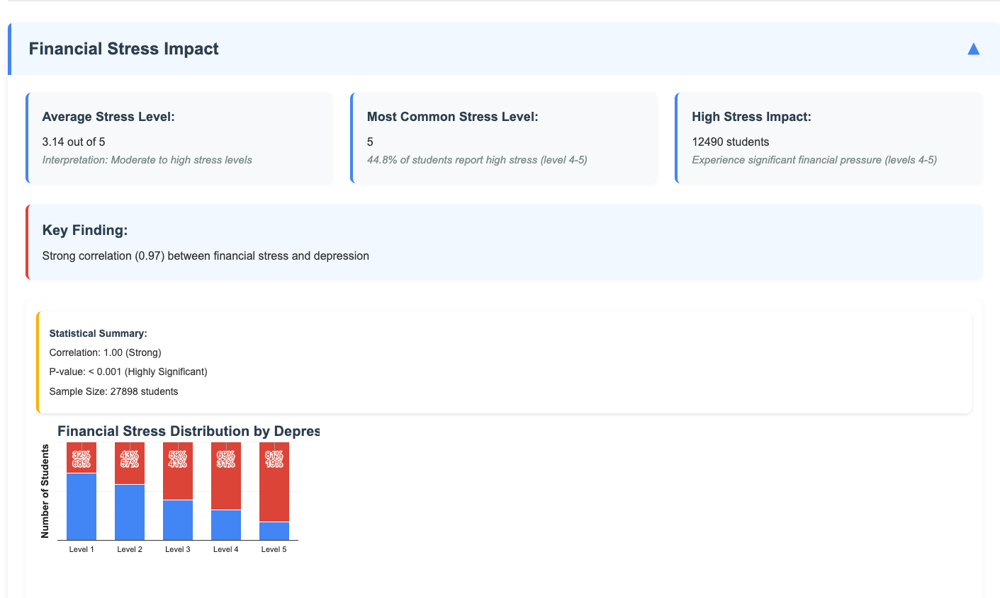
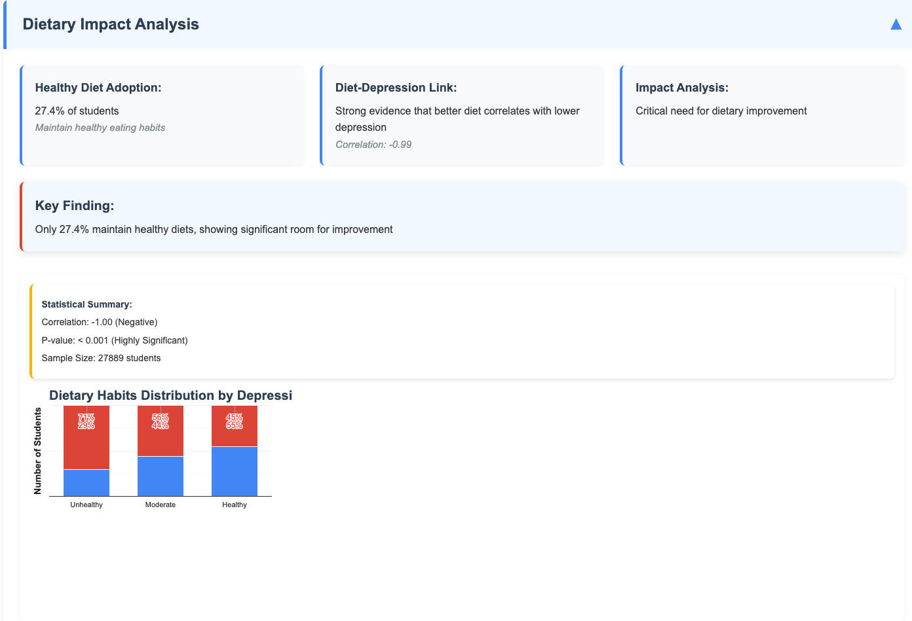
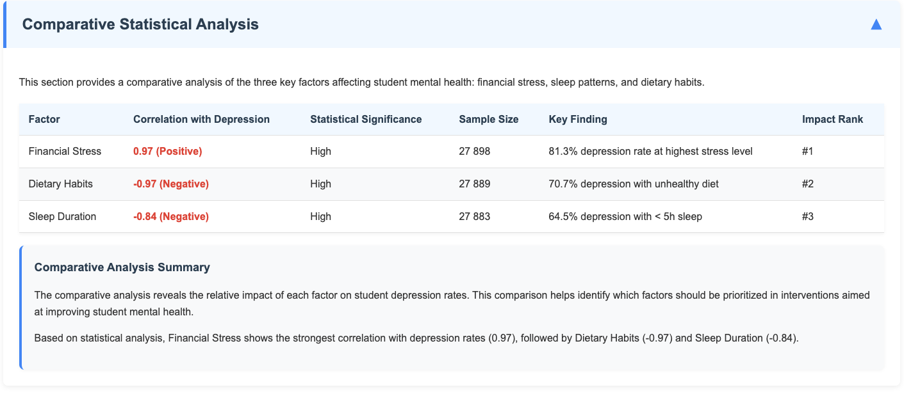

# Visualizations of Student Mental Health Analysis

This document provides an overview of the visualizations created for the analysis of mental health issues among students in India, with focus on the relationship between depression and various factors.

## Overview of Visualizations

The project includes several key visualizations that illustrate the relationships between depression and three main factors:

1. Financial Stress
2. Sleep Duration
3. Dietary Habits

Additionally, a comparative analysis visualization shows the relative impact of each factor.

## Financial Stress and Depression

This visualization shows:
- Distribution of students across different financial stress levels (1-5)
- Percentage of depressed vs. non-depressed students at each level
- A strong positive correlation (r=0.97) between financial stress and depression
- Clear trend showing that higher financial stress levels are associated with higher depression rates
- At the highest stress level (5), 81.3% of students show depression symptoms

## Sleep Duration and Depression

This visualization shows:
- Distribution of students across different sleep duration categories
- Percentage of depressed vs. non-depressed students in each category
- A strong negative correlation (r=-0.84) between sleep duration and depression
- Clear trend showing that shorter sleep durations are associated with higher depression rates
- Among students sleeping less than 5 hours, 64.5% show depression symptoms

## Dietary Habits and Depression

This visualization shows:
- Distribution of students across different dietary habit categories
- Percentage of depressed vs. non-depressed students in each category
- A strong negative correlation (r=-0.97) between healthier diet and depression
- Clear trend showing that unhealthier diets are associated with higher depression rates
- Among students with unhealthy diets, 70.7% show depression symptoms

## Comparative Analysis

This visualization provides:
- Side-by-side comparison of all three factors
- Correlation strength and direction for each factor
- Statistical significance of each relationship
- Sample sizes for each analysis
- Ranking of factors by impact on depression rates

## Implementation Details

All visualizations were created using Google Charts library with the following features:
- Stacked percentage bar charts for categorical data visualization
- Trendlines to show correlations visually
- Statistical overlays showing correlation coefficients and p-values
- Color coding to distinguish between depressed and non-depressed groups
- Interactive tooltips for detailed information on hover

## Conclusion

These visualizations clearly demonstrate that all three factors have strong correlations with depression rates among students, with financial stress showing the strongest positive correlation, followed by dietary habits and sleep duration (both negative correlations).

## Attribution and Methodology Footer

The footer section of the visualization page includes:
- Creator attribution (Lucy Sonberg)
- Project title and scope
- Date of analysis (April 1 - May 4, 2025)
- Methodology overview, including correlation calculation adjustments
- Data filtering methodology
- Copyright and data usage information

This footer provides important context about how the visualizations were created and the statistical methods employed to ensure accurate representation of the relationships.

---

Created by: Lucy Sonberg  
Date: April 1 - May 4, 2025 