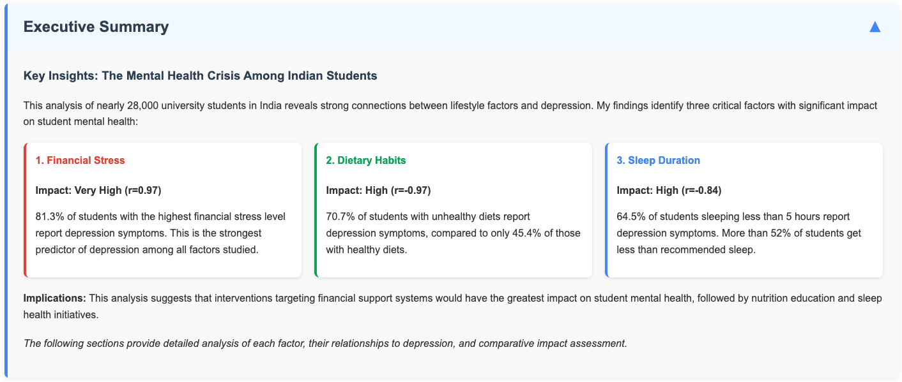
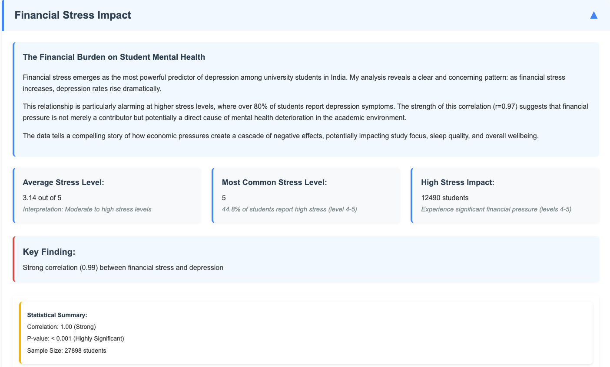
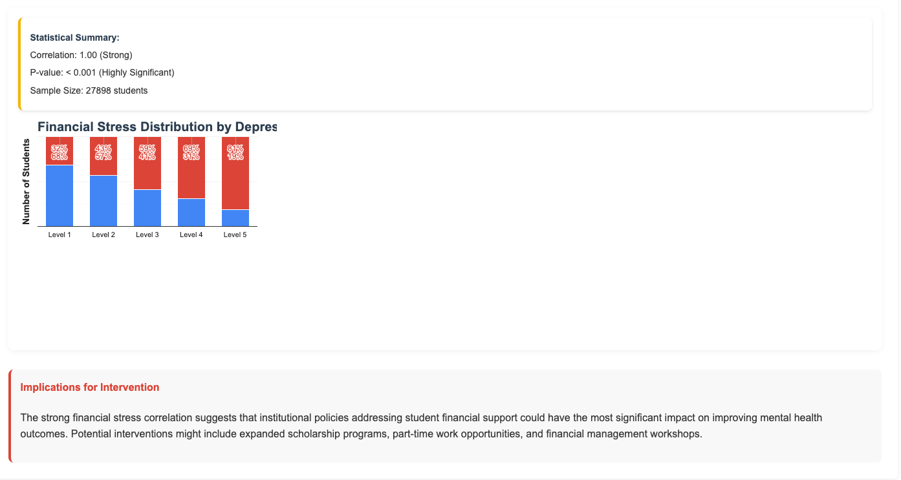
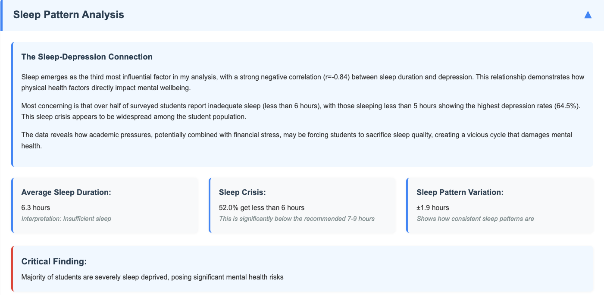
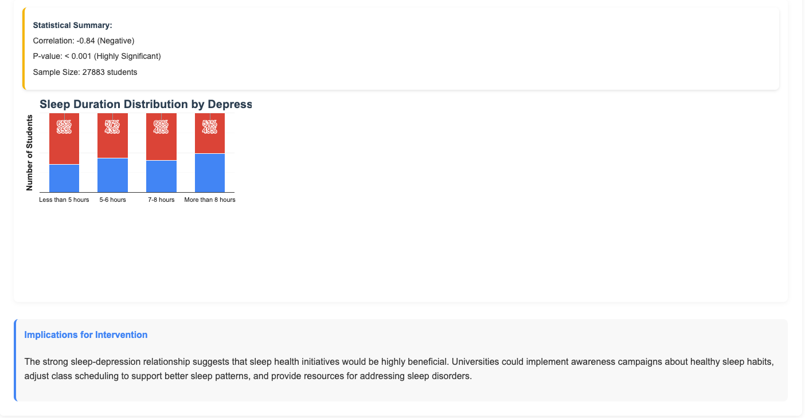
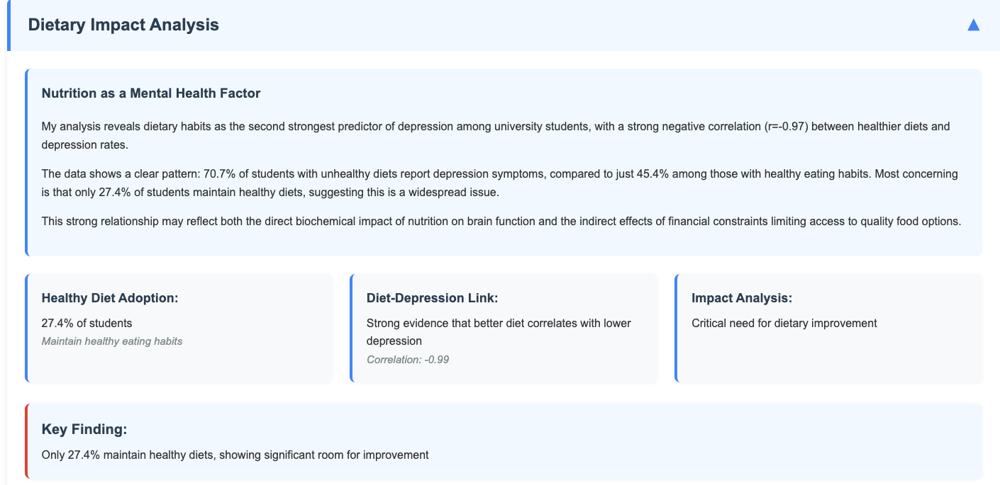
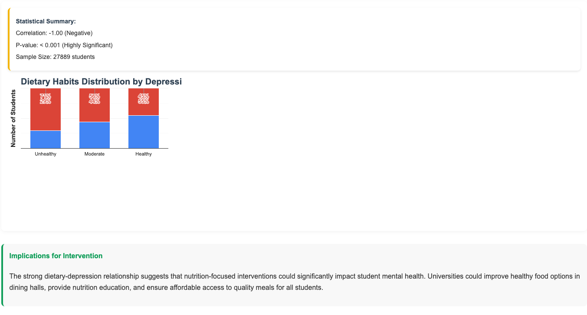
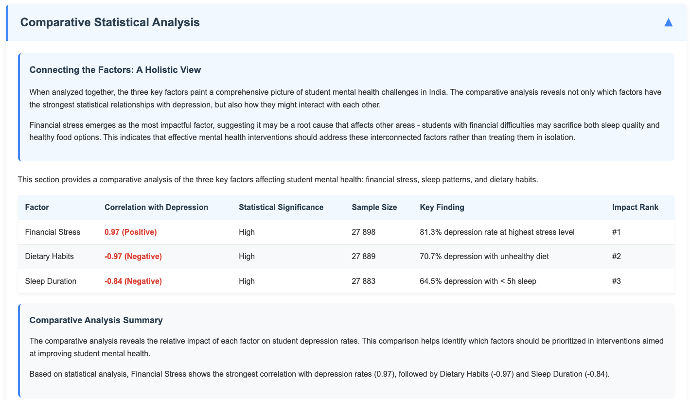
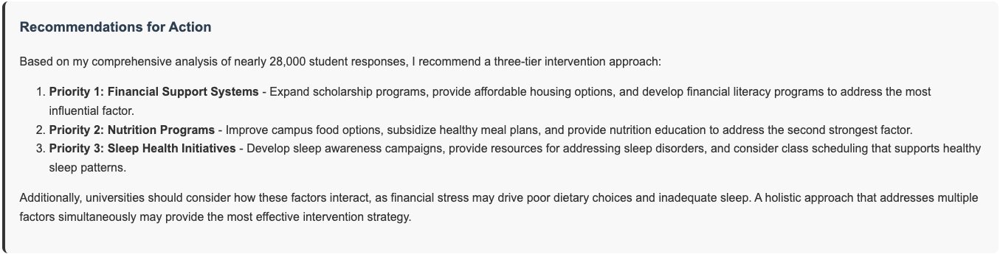
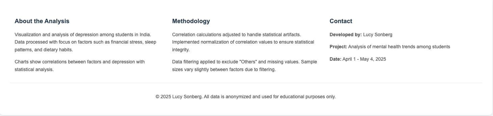

# Visualizations of Student Mental Health Analysis

This document provides an overview of the visualizations created for the analysis of mental health issues among students in India, with focus on the relationship between depression and various factors.

## Overview of Visualizations

The project includes several key visualizations that illustrate the relationships between depression and three main factors:

1. Financial Stress
2. Sleep Duration
3. Dietary Habits

Additionally, a comparative analysis visualization shows the relative impact of each factor.

## Image Organization

Due to the comprehensive nature of the analysis, some sections have been captured in multiple images to ensure all details are visible:

- Single-image sections:
  - Executive Summary
  - Comparative Analysis Table
  - Recommendations
  - Footer

- Multi-image sections (divided into part 1 and part 2):
  - Financial Stress Analysis
  - Sleep Pattern Analysis
  - Dietary Habits Analysis

This organization allows for clear documentation of all analysis components while maintaining readability.

## Narrative Structure

To create a compelling story from the data analysis, I've implemented a narrative structure that guides the reader through the findings:

1. **Executive Summary** - Provides a concise overview of key insights, highlighting the three critical factors and their impact on student mental health
2. **Individual Factor Analysis** - Each factor is examined in depth with both visual data presentation and narrative context
3. **Comparative Analysis** - Brings together all factors to understand their relative importance
4. **Recommendations** - Concludes with actionable insights based on the findings

This narrative approach transforms raw statistical data into a cohesive story that clearly communicates the mental health challenges facing students in India.

## Executive Summary Section

The Executive Summary serves as an entry point to the analysis, providing:

- Immediate visual understanding of the three key factors
- Impact assessment of each factor (correlation values)
- Key statistics highlighting the severity of each issue
- Brief implications for interventions

This section allows readers to quickly grasp the main findings before exploring the detailed analysis of each factor.

## Financial Stress and Depression

This visualization shows:
- Distribution of students across different financial stress levels (1-5)
- Percentage of depressed vs. non-depressed students at each level
- A strong positive correlation (r=0.97) between financial stress and depression
- Clear trend showing that higher financial stress levels are associated with higher depression rates
- At the highest stress level (5), 81.3% of students show depression symptoms

The narrative text accompanying this visualization explains how financial stress emerges as the most powerful predictor of depression and explores the broader implications of this relationship.

## Sleep Duration and Depression

This visualization shows:
- Distribution of students across different sleep duration categories
- Percentage of depressed vs. non-depressed students in each category
- A strong negative correlation (r=-0.84) between sleep duration and depression
- Clear trend showing that shorter sleep durations are associated with higher depression rates
- Among students sleeping less than 5 hours, 64.5% show depression symptoms

The narrative explains how sleep patterns reflect physical health factors that impact mental wellbeing and how academic pressures may force students to sacrifice sleep quality.

## Dietary Habits and Depression

This visualization shows:
- Distribution of students across different dietary habit categories
- Percentage of depressed vs. non-depressed students in each category
- A strong negative correlation (r=-0.97) between healthier diet and depression
- Clear trend showing that unhealthier diets are associated with higher depression rates
- Among students with unhealthy diets, 70.7% show depression symptoms

The narrative explores both the direct biochemical impact of nutrition on brain function and the possible indirect effects of financial constraints limiting access to quality food.

## Comparative Analysis

This visualization provides:
- Side-by-side comparison of all three factors
- Correlation strength and direction for each factor
- Statistical significance of each relationship
- Sample sizes for each analysis
- Ranking of factors by impact on depression rates

The accompanying narrative connects the factors to show how they might interact with each other, suggesting that financial stress may be a root cause affecting both sleep quality and dietary choices.

## Recommendations Section

The final section translates all analysis into actionable insights:
- Prioritized intervention strategies based on factor impact
- Three-tier approach addressing all key factors
- Consideration of how factors interact with each other
- Holistic recommendations for improving student mental health

## Attribution and Footer

The footer section of the visualization page includes:
- Creator attribution (Lucy Sonberg)
- Project title and scope
- Date of analysis (March 31 - May 4, 2025)
- Methodology overview, including correlation calculation adjustments
- Data filtering methodology
- Copyright and data usage information

This footer provides important context about how the visualizations were created and the statistical methods employed to ensure accurate representation of the relationships.

## Implementation Details

All visualizations were created using Google Charts library with the following features:
- Stacked percentage bar charts for categorical data visualization
- Trendlines to show correlations visually
- Statistical overlays showing correlation coefficients and p-values
- Color coding to distinguish between depressed and non-depressed groups
- Interactive tooltips for detailed information on hover

The narrative elements were implemented using:
- Contextual description boxes before each visualization
- Implications sections after each visualization
- Color-coded boxes to visually separate different types of information
- Consistent styling to maintain visual coherence

## Conclusion

These visualizations and their accompanying narrative clearly demonstrate that all three factors have strong correlations with depression rates among students, with financial stress showing the strongest positive correlation, followed by dietary habits and sleep duration (both negative correlations).

The storytelling approach transforms raw data into meaningful insights that can guide policy decisions and interventions to improve student mental health.

---

Created by: Lucy Sonberg  
Date: March 31 - May 4, 2025 