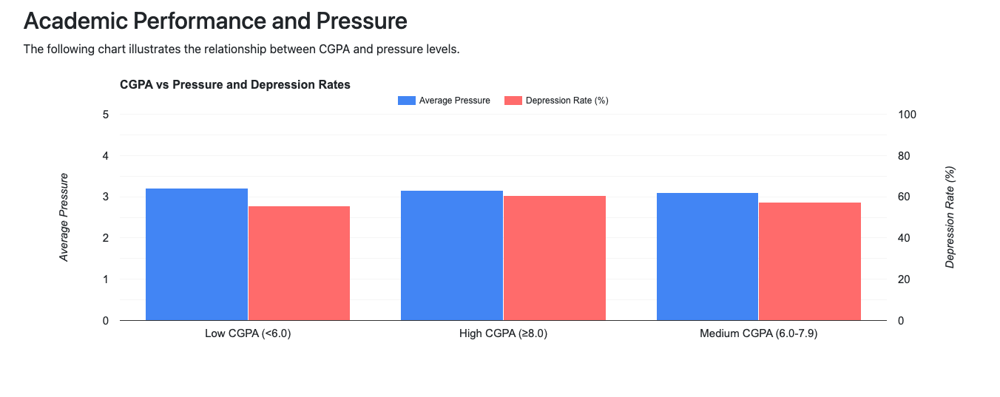

# Academic Pressure Analysis Findings

## Overview
This document summarizes the key findings from our analysis of academic pressure and its relationship with depression among Indian students. The analysis is based on data from our student mental health survey.

## Key Findings

### 1. Pressure Level Distribution
- **Total Students Analyzed**: ~28,000 students
- **Pressure Level Categories**:
  - No Pressure: 6 students (0.02% of total)
  - Low Pressure: 8,980 students (32.1%)
  - Moderate Pressure: 7,462 students (26.7%)
  - High Pressure: 11,453 students (41.1%)

### 2. Depression Rates by Pressure Level
- **No Pressure**: 50% depression rate
  - Despite reporting no pressure, half of these students show signs of depression
  - Very small sample size (only 6 students) makes this statistic less reliable
- **Low Pressure**: ~28% depression rate
  - Lowest depression rate among all categories
  - Suggests that some level of pressure might be normal
- **Moderate Pressure**: ~60% depression rate
  - Significant increase in depression rate from low pressure
- **High Pressure**: ~82% depression rate
  - Highest depression rate
  - Affects the largest group of students

### 3. Key Observations
1. **Pressure is Prevalent**:
   - Only 6 out of ~28,000 students report no academic pressure
   - Over 41% of students experience high pressure

2. **Pressure-Depression Correlation**:
   - Clear positive correlation between pressure levels and depression rates
   - Depression rates triple from low pressure (28%) to high pressure (82%)

3. **Critical Concerns**:
   - The majority of students (41.1%) are in the high-pressure category
   - These students also show the highest depression rates
   - This suggests a serious mental health concern that needs addressing

## Visualizations
The findings are visualized in three main charts:
1. Distribution of Pressure Levels and Depression Rates
   
   - Shows the number of students in each pressure category
   - Displays depression rates for each pressure level
   - Highlights the correlation between pressure and depression

2. Sleep Duration vs Pressure and Depression Rates
   
   - Illustrates how sleep patterns relate to academic pressure
   - Shows depression rates across different sleep durations
   - Reveals potential relationships between sleep and mental health

3. Academic Performance (CGPA) vs Pressure and Depression Rates
   
   - Demonstrates the relationship between academic performance and pressure
   - Shows how depression rates vary with CGPA
   - Highlights potential academic impact of mental health issues

## Recommendations
1. **Immediate Attention Required**:
   - Focus on the 41% of students experiencing high pressure
   - Develop interventions for students showing both high pressure and depression

2. **Further Investigation Needed**:
   - Study the factors contributing to academic pressure
   - Analyze the relationship between pressure and other variables (sleep, CGPA)
   - Investigate protective factors in low-pressure students with no depression

3. **Support Systems**:
   - Develop academic support systems to help manage pressure
   - Implement regular mental health screenings
   - Create awareness about the relationship between academic pressure and depression

## Technical Notes
- Data collected through student surveys
- Analysis performed using SQL queries and Google Charts
- Visualizations created using combination charts with both bars and percentages
- Special handling required for "No Pressure" category due to small sample size 