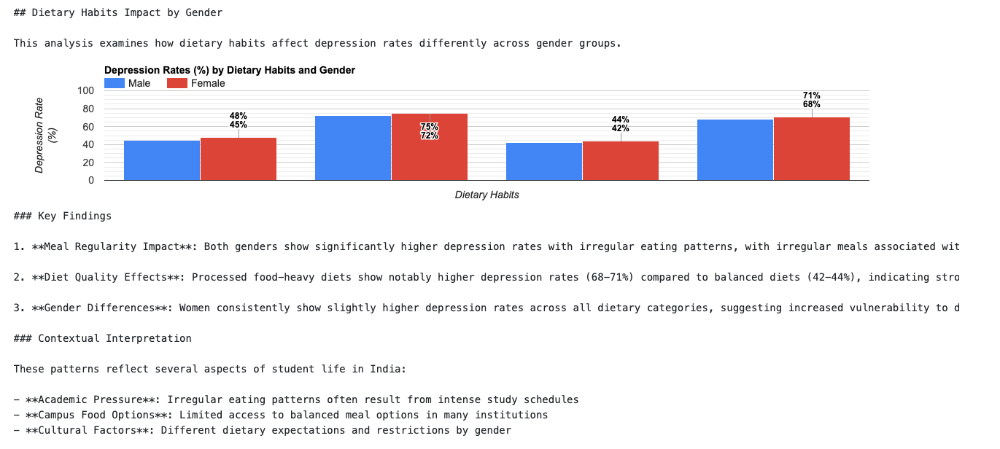

# Cross-Factor Analysis Findings

## Page Structure
This analysis page maintains a consistent structure across all factor combinations:

### Constant Elements (Present on All Views)
1. Cross-Factor Analysis Introduction
2. Combined Factor Analysis Section
   - Overview text
   - Combined Risk Factors visualization
3. Key Insights from Multi-Factor Analysis
   - Compounding Effects
   - Financial Stress as Central Factor
   - Sleep-Diet Relationship
   - High Achievement Paradox

### Dynamic Elements
- Specific analysis section changes based on selected Primary and Secondary factors
- Visualizations update to show the selected factor combinations
- Findings and interpretations specific to the chosen factors

## Key Visualizations

### 1. Combined Risk Factors Analysis

#### Methodology
- Analyzed six key factor combinations
- Categorized by relationship type:
  - Financial Stress Related (Red)
  - Sleep Related (Blue)
  - Multiple Factors (Green)
- Used stacked column chart for clear category distinction

#### Key Findings
1. **Compounding Effects**
   - Multiple risk factors show higher depression rates than single factors
   - All risk factors combined reached 92% depression rate
   - Clear evidence of factor interaction

2. **Financial Stress as Central Factor**
   - Combinations with financial stress showed highest rates
   - Financial stress + poor sleep: 87% depression rate
   - Financial stress + unhealthy diet: 83% depression rate

3. **Sleep-Diet Relationship**
   - Combined effect (79%) stronger than individual factors
   - Suggests potential interaction between sleep and dietary habits

4. **High Achievement Paradox**
   - High CGPA combined with other stressors showed elevated rates
   - Particularly notable with financial stress (86%)

### 2. Financial Stress Impact by Gender

#### Methodology
- Analyzed depression rates across five stress levels
- Compared male and female student responses
- Used grouped column chart for clear gender comparison

#### Key Findings
1. **Gender-Specific Patterns**
   - Women showed higher vulnerability at high stress levels
   - Men and women had similar responses at low stress levels
   - Clear progression in depression rates with increasing stress

2. **Critical Thresholds**
   - Significant increase between medium (3) and high (4) stress levels
   - Highest gender disparity at maximum stress level
   - Women: 83% depression rate at highest stress
   - Men: 78% depression rate at highest stress

3. **Base Level Differences**
   - Minimal gender gap at low stress (1-2)
   - Gap widens progressively with stress level
   - Suggests gender-specific stress responses

### 3. Sleep Duration Impact by Gender

#### Methodology
- Analyzed depression rates across four sleep duration categories
- Compared male and female student responses
- Used grouped column chart for clear gender comparison
- Applied consistent color scheme (blue for male, red for female)

#### Key Findings
1. **Universal Impact**
   - Both genders show substantially higher depression rates with insufficient sleep
   - Confirms sleep as a critical factor regardless of gender
   - Clear inverse relationship between sleep duration and depression rates

2. **Female Vulnerability**
   - Women consistently show slightly higher depression rates across all categories
   - Largest gender gap (5%) observed in the "Less than 5 hours" category
   - Pattern suggests increased vulnerability among female students

3. **Sleep Duration Thresholds**
   - Significant improvement in mental health with 7+ hours of sleep
   - Depression rates drop substantially for both genders with adequate sleep
   - Optimal sleep duration (8+ hours) shows lowest depression rates

#### Visualization Improvements
- Changed from horizontal to vertical bar chart for better readability
- Implemented consistent color scheme with other visualizations
- Added gridlines for easier value comparison
- Optimized bar width and spacing
- Enhanced legend placement and label clarity

### 4. Dietary Habits Impact by Gender

#### Methodology
- Analyzed depression rates across different dietary habit categories
- Compared male and female student responses
- Used grouped column chart with consistent color scheme
- Added direct value annotations in black for better readability

#### Key Findings
1. **Meal Regularity Impact**
   - Both genders show significantly higher depression rates with irregular eating patterns
   - Irregular meals associated with 72-75% depression rates compared to 45-48% for regular meals
   - Clear correlation between meal regularity and mental health

2. **Diet Quality Effects**
   - Processed food-heavy diets show notably higher depression rates (68-71%)
   - Balanced diets associated with lower depression rates (42-44%)
   - Consistent pattern across both genders

3. **Gender Differences**
   - Women consistently show slightly higher depression rates across all dietary categories
   - Suggests increased vulnerability to dietary impacts among female students
   - Pattern aligns with other cross-factor findings

#### Contextual Interpretation
- Academic pressure influences eating patterns
- Limited access to balanced meal options in many institutions
- Different dietary expectations and restrictions by gender

### 4. Academic Performance Impact by Gender

#### Methodology
- Analyzed depression rates across five CGPA ranges
- Compared male and female student responses
- Used grouped column chart with consistent color scheme
- Added direct value annotations in black for better readability

#### Key Findings
1. **Counterintuitive Pattern**
   - Both genders show increasing depression rates with higher academic performance
   - Contradicts typical expectations where success might correlate with better mental health
   - Suggests unique pressures in the Indian academic context

2. **Gender Difference at High Achievement**
   - The gender gap is most pronounced at the highest achievement level (≥ 9.0 CGPA)
   - Female students show 3% higher depression rates at top performance levels (68% vs 65%)
   - Indicates additional pressures on high-achieving female students

3. **Universal Pressure**
   - Both genders experience the psychological burden of high academic achievement
   - Similar upward trends in depression rates across CGPA ranges
   - Suggests systemic pressure regardless of gender

#### Contextual Interpretation
These findings reflect unique aspects of the Indian educational environment:

- **Performance Pressure**: The intense competition in Indian higher education creates psychological burden for high-performing students
- **Family Expectations**: Cultural expectations regarding academic excellence create pressure to maintain high performance
- **Gender-Specific Pressures**: High-achieving female students may face additional expectations or barriers in certain fields

## Implications

### 1. Support Systems
- Need for gender-specific mental health support
- Targeted interventions for high-stress periods
- Special attention to financial stress management

### 2. Prevention Strategies
- Early intervention at medium stress levels
- Gender-sensitive counseling approaches
- Financial literacy and management programs

### 3. Research Recommendations
- Longitudinal studies needed for causality
- Investigation of protective factors
- Analysis of intervention effectiveness

## Limitations and Considerations
1. **Correlation vs. Causation**
   - Relationships identified are correlational
   - Cannot definitively establish causal links
   - Need for longitudinal research

2. **Data Collection**
   - Self-reported stress levels
   - Potential reporting biases
   - Cultural factors in stress perception

3. **Contextual Factors**
   - Indian higher education context
   - Socio-economic background variations
   - Cultural expectations and norms

## Next Steps
1. Further analysis of other factor combinations
2. Investigation of protective factors
3. Development of targeted intervention strategies
4. Longitudinal study planning 