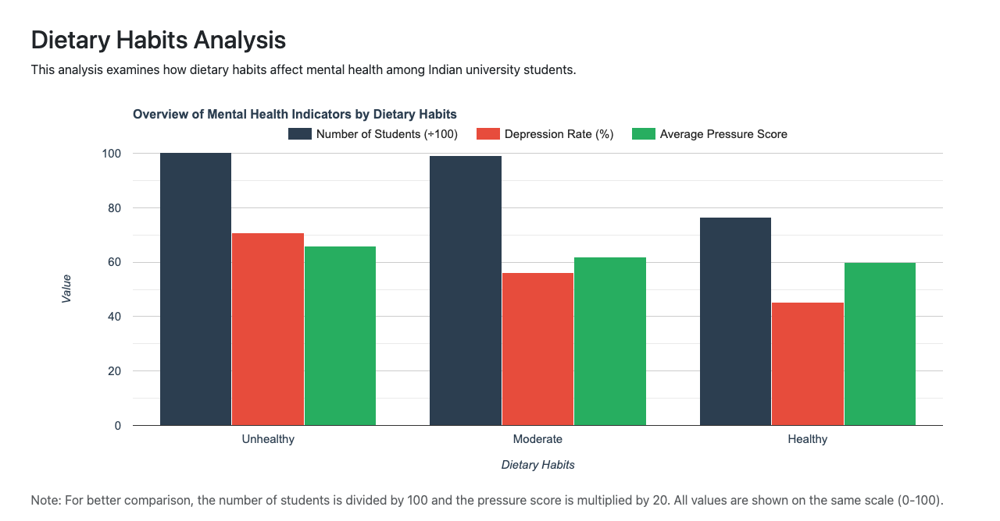
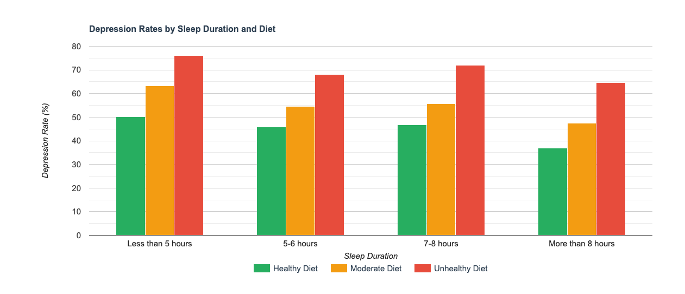
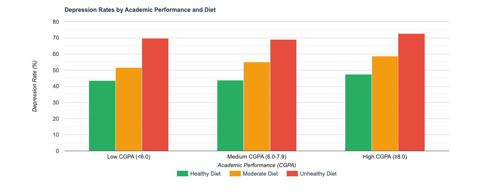

# Dietary Habits and Mental Health: Analysis and Findings

## Overview
This analysis examines the relationship between dietary habits and mental health among Indian university students. We have analyzed three main aspects:
1. Distribution of dietary habits and mental health indicators
2. Relationship between dietary habits, sleep patterns, and depression
3. Connection between dietary habits, academic performance, and depression

## Key Findings

### 1. Distribution and Mental Health Indicators

- **Student Distribution:**
  - Unhealthy dietary habits: ~10,300 students
  - Moderate dietary habits: ~9,900 students
  - Healthy dietary habits: ~7,650 students

- **Depression Rates:**
  - Unhealthy dietary habits: 70.73%
  - Moderate dietary habits: 56.02%
  - Healthy dietary habits: 45.39%

- **Pressure Levels** (scale 1-5):
  - Unhealthy dietary habits: 3.30
  - Moderate dietary habits: 3.09
  - Healthy dietary habits: 3.00

### 2. Dietary Habits and Sleep Patterns

- Students with healthy dietary habits and more than 8 hours of sleep show the lowest depression rate (36.81%)
- Students with unhealthy dietary habits and less than 5 hours of sleep show the highest depression rate (76.04%)
- Clear pattern showing both dietary habits and sleep duration affect mental health

### 3. Dietary Habits and Academic Performance

- High-performing students (CGPA ≥8.0):
  - Healthy dietary habits: 47.39% depression
  - Moderate dietary habits: 58.70% depression
  - Unhealthy dietary habits: 72.58% depression

- Low-performing students (CGPA <6.0):
  - Healthy dietary habits: 43.52% depression
  - Moderate dietary habits: 51.52% depression
  - Unhealthy dietary habits: 69.66% depression

## Conclusions
1. Strong correlation between dietary habits and mental health
2. Combination of good dietary habits and sufficient sleep appears to have a protective effect against depression
3. Academic performance is negatively affected by unhealthy dietary habits, regardless of performance level
4. Pressure levels gradually increase with poorer dietary habits

## Recommendations
1. Implement programs to promote healthy dietary habits on campus
2. Raise awareness about the connection between diet, sleep, and mental health
3. Provide support and resources for students to improve their dietary habits
4. Integrate dietary advice into existing mental health programs

## Technical Details
The visualizations were created using Google Charts and are implemented in `statistics-template-5/js/dietary_analysis.js`. Data is fetched dynamically from the database and presented in real-time on the webpage. 