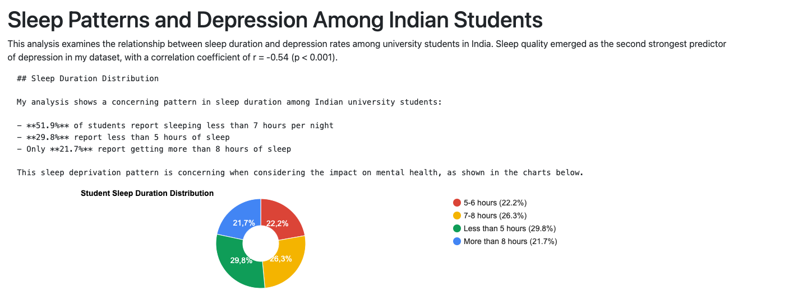
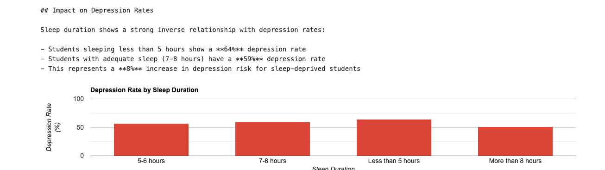

# Sleep Patterns Analysis Findings

## Overview
This analysis examines the relationship between sleep patterns and depression among Indian university students. A significant correlation (r = -0.54, p < 0.001) was found between sleep quality and depression rates.

## Key Visualizations

### 1. Sleep Duration Distribution

Key findings:
- 29.8% of students get less than 5 hours of sleep
- Only 21.7% get more than 8 hours of sleep
- 26.3% get 7-8 hours of sleep
- 22.2% get 5-6 hours of sleep

### 2. Depression Rate by Sleep Duration

Key findings:
- Students sleeping less than 5 hours show a 64% depression rate
- Students with adequate sleep (7-8 hours) have a 59% depression rate
- There is an 8% increase in depression risk for sleep-deprived students
- Even students with more than 8 hours of sleep show significant depression rates

## Implications
The data reveals a concerning pattern where insufficient sleep is prevalent among Indian university students, with a clear correlation to higher depression rates. This suggests that:
1. Sleep health should be a priority in student wellness programs
2. Interventions targeting sleep habits might help reduce depression rates
3. Further investigation into causes of sleep deprivation may be warranted 